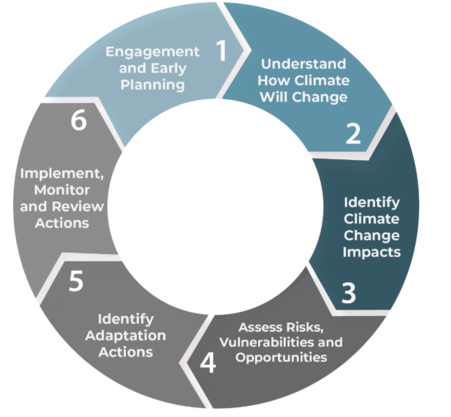

# Climate information and data decision support tool


## Background


Climate information, specifically of future climate projections, is a crucial input to climate change risk assessments and subsequent adaptation planning.  However, decision makers often lack understanding of the decision framework underpins climate information data and use for practical use, and furthermore may not be capable of confidently identifying 'best in class' information and data sources.

The tool encapsulated in this Jupyter Notebook is meant to aid users in 1) deciding which climate information would be useful for their climate change risk/adaptation work, and 2) providing access to user-specific well-vetted information and data.  In helping users in their initial climate information decision process, this tool implicitly guides users through the first key steps of a climate change risk/adaptation workflow, and furthermore provides them with useful links to real, user-relevant, decision-guided climate data and information.

## Decision Support Tool Design

### Conceptual Design

#### Climate Change Impact, Risk, and Vulnerability Assessment Methods



Climate change information is most often used for impact, vulnerability and risk analyses in support of climate adaptation planning.  For this reason, the decision rules encapsulated in this decision support tool reflect fundamental elements of general vulnerability and risk assessment.  In particular, the first steps of general vulnerability and risk assessment (e.g. [ISO 31000:2018](https://www.iso.org/obp/ui/#iso:std:iso:31000:en)) are used to develop an understanding of the major components of a system in question, and the major impacts that may present risk to these components.  These principles form much of the basis of key climate change risk assessment frameworks in use today in Canada across multiple sectors, including engineering ([PIEVC](https://pievc.ca/)), community planning ([ICLEI BARC](https://icleicanada.org/barc-program/)), and this vulnerability and risk-relevant information and data sources is a second key outcome.

#### Decision Support System Methods

The decision rules and general design of this tool also adhers to [general principles of decision support systems](http://citeseerx.ist.psu.edu/viewdoc/download?doi=10.1.1.476.4750&rep=rep1&type=pdf) which generally target unstructured, poorly specified problems, combine user interaction and guidance with data access and retrieval functions, are easy and intuitive to use interactive; and are adaptable to changes in specific applications and decision making approaches.  Such tools help decision makers utilize data to solve unstructured problems - in this case, to perform climate impact, vulnerability and risk assessments.

Production versions of this tool meet the following *conceptual* constraints (which must be satisfied in all future tool versions):

1. Adher to accepted impact, vulnerability and risk assessment principles (even if these principles are not explicitly stated to users)
2. Adher to decision support systems principles (even if these principles are not explicitly stated to users)
3. Remain flexible (ideally via input file changes and minimal/no code alteration) to application across arbitrary sectors, domains and systems 

### Software Design

This tool is currently written in Python, within a [Jupyter Notebook](https://jupyter.org/) environment.  It is fully version controlled using [Git](https://git-scm.com/), and [hosted on Github.com](https://github.com/ECCC-CCCS/decision-support-tool).  Hosting on the latter site allows - for example - easy localhost or truly web-based development testing using MyBinder.

Within the Python framework, the tool currently relies heavily on the [Panels](https://panel.holoviz.org/) package, which "lets you create custom interactive web apps and dashboards by connecting user-defined widgets to plots, images, tables, or text."  In addition to Panels, the tool uses a selection of Holoviews ecosystem tools, as well as a suite of standard Python modules.  Panels-based apps can be rapidly developed and prototyped directly within a Jupyter Notebook environment, before being directly deployed as Python-based standalone apps.  The latter functionality is possible because Panel is developed on top of Bokeh, which provides access to a Tornado based web server ([Bokeh Server](https://docs.bokeh.org/en/latest/docs/user_guide/server.html)) that synchronizes data between the underlying Python environment and the BokehJS library running in the browser.

The Python code that constitutes this tool has been carefully designed so that it is entirely agnostic to sector.  To apply the tool to a different sector/system, the developer only needs to alter a set of input files - not the code base itself.  Different sector-specific manifestations of the tool are tracked on separate Git branches within this repository.  They should all maintain, however, identical base .ipynb code bases, with the main branch existing as a common location to gather updates to this code, produced in the work of advancing sector-specific branch versions.

Production versions of this tool meet the following *software* constraints (which must be satisfied in all future tool versions):

1. The tool must be natively Python-based for access to advanced visualization tools, and ease of prototyping and deployment
2. The tool must be entirely open source and version controlled
3. Web implementation of the tool must be low-latency and available on demand, and allow for simultaneous production and development
4. The base Python code must remain entirely sector-agnostic, and sector-specific instances of the tool need to be entirely manifested through changes to input files.

## Configuring and Running 

This Python Jupyter Notebook script enables the basic functionality of a building/climate change decision support tool.  It has been developed in a  local laptop environment using Anaconda-based Jupyter installation, on Python V3.7.  Use of other Python versions is certainly possible but not supported at present.  Note Python module dependencies - you will need to install these before executing this script successfully.

Displaying the Notebook directly in-line in the Notebook is the fastest way to test the behaviour of the tool.  Deployment to MyBinder (via Github) is the fastest way to test a simple web-based deployment.

## In-line Documentation

This code base provides extensive in-line documentation (in Markdown syntax) that describes how the implemented Python code addresses the conceptual and software constraints described above.  This in-line documentation should be considered the definitive documentation source for the tool.  Any substantial changes to the tool itself should be immediately reflected in this documentation.

The code flow of this tool is organized around objects required to develop a Panel-based app.  In general, such apps can be organized via a range of methods (accordion expansions, tabs, etc.).  A tabs-based approach is chosen here to organize and present high-level sections of the tool.  As the content of each tab is developed sequentially 'in order of appearance' before being aggregated into the final app object, code can be read sequentially Within the core section of the tool (the Decision Support Tool tab), Panels Pipeline architecture is adopted in order to collect and pass user-provided impact and vulnerability information forward through a decision support system conceptual flow.

Information inputs to the tool are, to the maximum extent possible, not hard-coded into the decision support tool code itself.  Instead, they are provided in input files (currently, .json files, which are ingested and used as dictionaries).

#TODO statements are used throughout code to identify future work opportunities.

# Decision Support Tool Software Guidelines


1. Install `pre-commit` tool to simplify commit review tasks

    ```
    pip install pre-commit
    pre-commit install
    ```

    To run `pre-commit` without making a commit, run `pre-commit run --all-files`.

2. In JupyterHub, edit the `decision-support-tool.ipynb`file as you wish

3. Edit `CHANGELOG.md` accordingly to indicate what you've changed

4. Add changes to git staging env

    ```
    git add -A
    ```

5. Commit changes

    ```
    git commit -m "changed something in the notebook"
    ```
    
    Runs `pre-commit` checks locally.

6. Tag version

    ```
    git tag <tag_name>
    git push origin <tag_name>
    ```

    This will trigger a GitHub Action which builds and push Docker image to https://hub.docker.com/r/crimca/decision-support-tool.

7. Verify that the container image is at https://hub.docker.com/r/crimca/decision-support-tool/tags

8. Test the image locally

    ## To build the container locally:

    ```
    docker build -t crimca/decision-support-tool:YOUR_VERSION_TAG .
    ```

    Note that this local container tag will be retrieved instead of the remote image.<br>
    This is good for debugging purposes. However, do not push this container to the repo, as it the job of the GitHub Action.

    ## To run the container:

    ```
    docker run -p 5006:5006 -e BOKEH_ALLOW_WS_ORIGIN=127.0.0.1:5006 crimca/decision-support-tool:YOUR_VERSION_TAG
    ```

    In your browser, go to http://127.0.0.1:5006/building-dst/decision-support-tool

9. If the app works as you want, this container version is ready to be deployed in the staging stack
